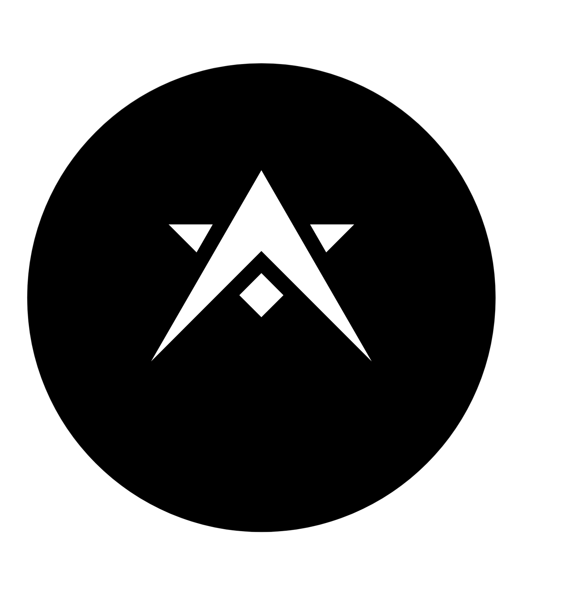
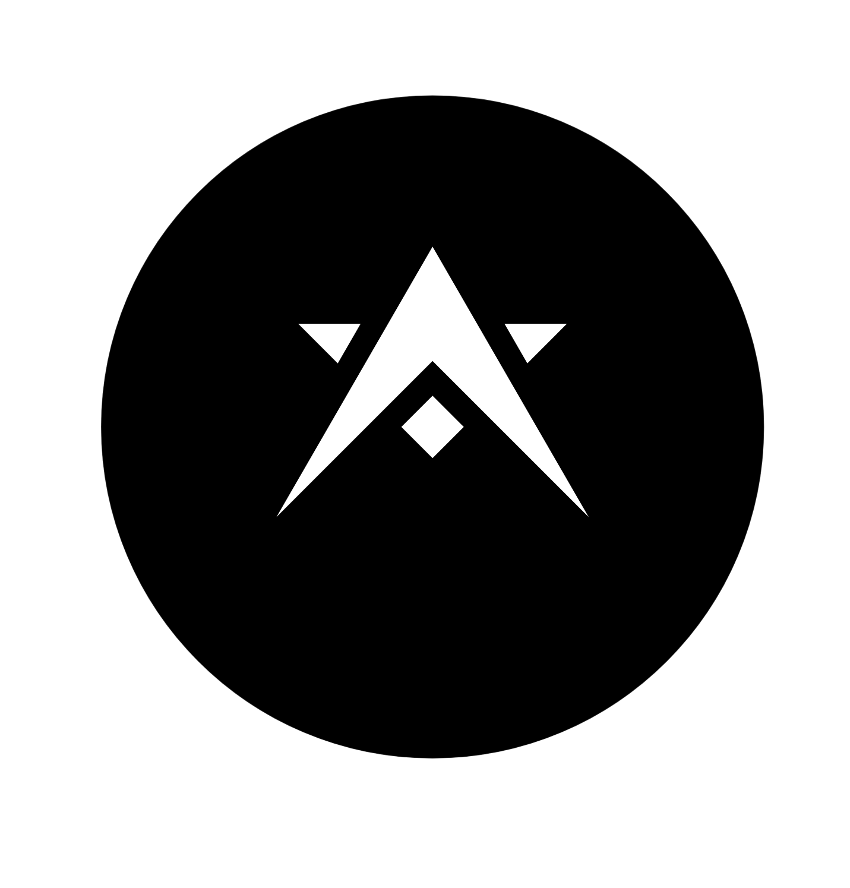
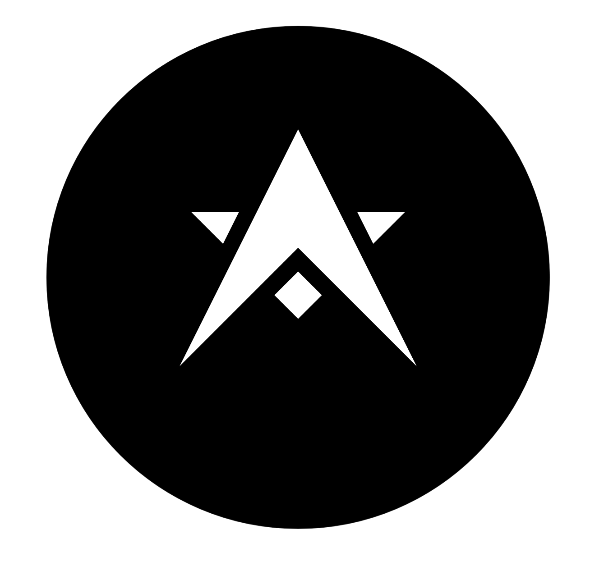
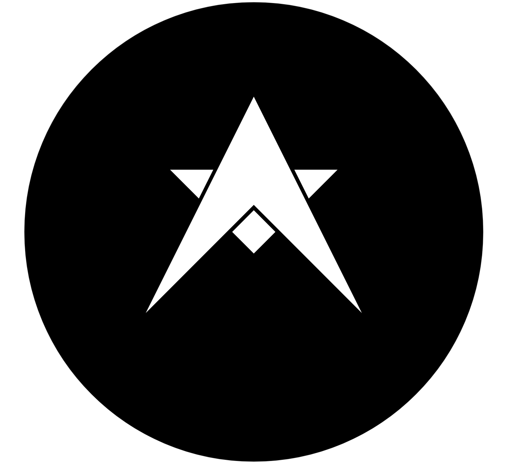
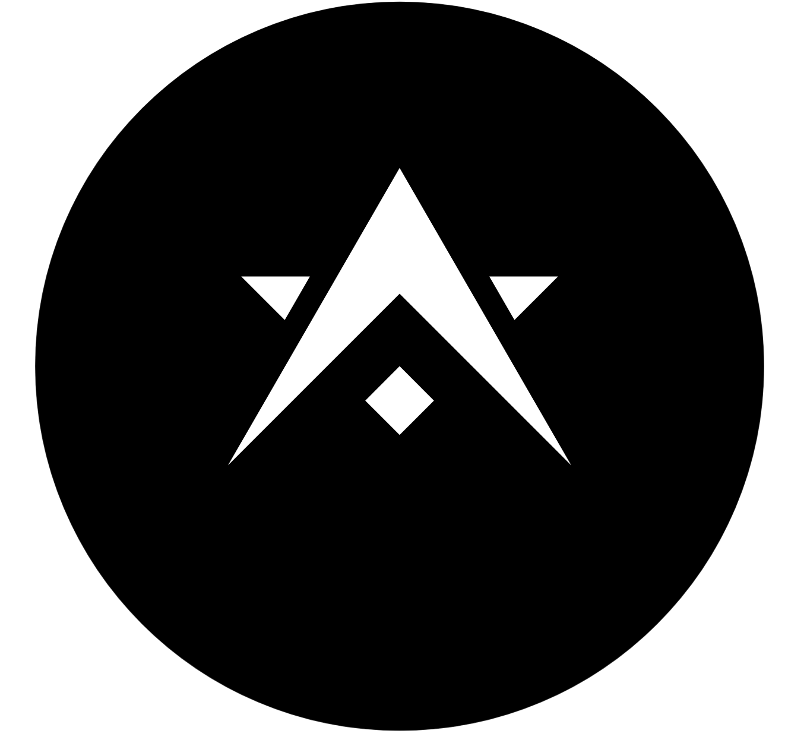
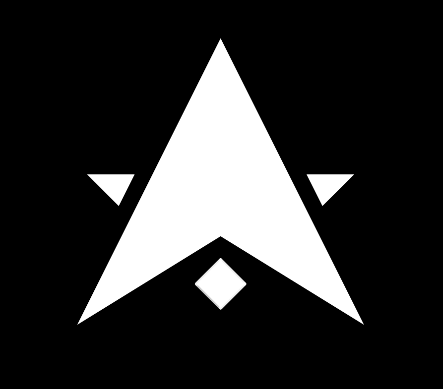
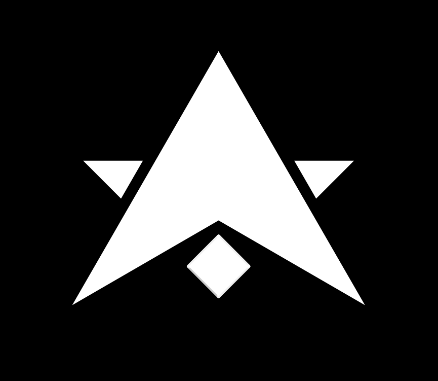

# Esoteric Foundation Logo

[![Project status: maintained][status]][root]

The official logo of the [Esoteric Foundation][author].

## Migration to Geogebra

### Serious Branch Considerations

#### Equilateral

- `equilateral-parallel`
  
  (Square can be made closer to triangle)
- `equilateral-parallel-circle-center`
  
  (Square can NOT be made closer to triangle)

#### $b = h$

- `base-equals-height-parallel`
  
  (Square can be made closer to triangle)
- `base-equals-height-parallel-circle`
  
  (Square can NOT be made closer to triangle)
- `base-equals-height-parallel-circle-center`
  
  (Square can NOT be made closer to triangle)

### Garbage Branches

- `equilateral-parallel-circle`:
  This branch sucks cause the square is way too far from the triangle.
  

- `base-equals-height-center`:
  The triangle is WAY too fat.
  

- `equilateral-center`:
  The triangle is too fat.
  

## License

  &copy; 2024-2025 <a rel="cc:attributionURL dct:creator" property="cc:attributionName" href="https://esoteric.foundation">Esoteric Foundation</a>

  <a property="dct:title" rel="cc:attributionURL" href="./">Esoteric Foundation Logo</a> is licensed under <a href="./LICENSE" target="_blank" rel="license noopener noreferrer" style="display: inline-block">CC BY-SA 4.0</a>.

  <a href="https://creativecommons.org/">

<!-- Link aliases -->

[root]: /

[author]: https://esoteric.foundation

<!-- Badges -->

[status]: ./assets/images/badges/status.svg
